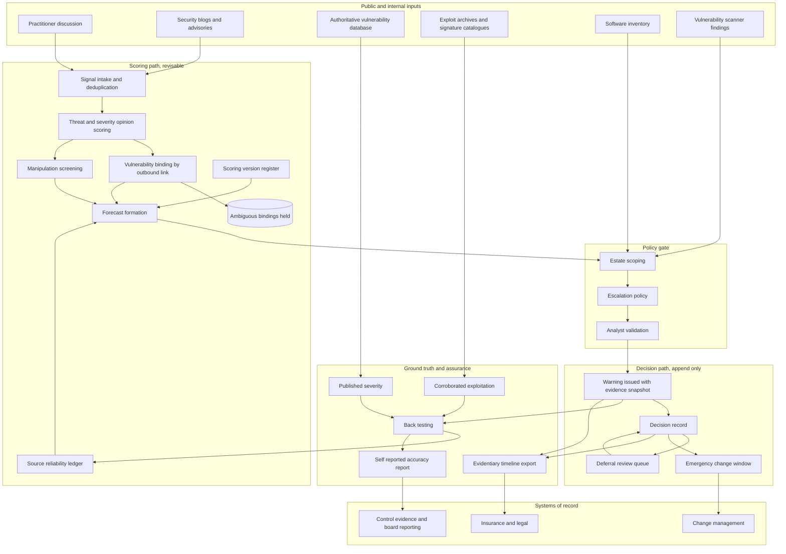

# Chattermark

**Source:** `ai-in-cyber/1902.10680v1/`
**Domain:** `ai-cyber`
**One-liner:** An exploit-likelihood early warning service that reads what practitioners are saying about a new vulnerability days before the National Vulnerability Database scores it, and tells a vulnerability manager which of this week's emergency change windows to spend — with every warning traceable to named sources whose historical hit rate is on the record.
**Wedge:** Vulnerability management teams at mid-market and upper-mid-market banks, insurers, and hospital groups that run formal change control with a documented emergency path and a contractual or regulatory patch clock on critical findings — organisations whose constraint is not "which CVEs are severe" but "we get four emergency windows a month and the queue has nine hundred criticals in it."
**Positioning:** Pre-disclosure patch prioritisation. Vulnerability scanners rank by CVSS, and threat-intel feeds rank by volume and buzz; both arrive after the vendor advisory and neither predicts exploitation well. The source shows why: ranking by the National Vulnerability Database's own CVSS scores put one exploited vulnerability in its top ten, while ranking by what practitioners said about the same vulnerabilities put seven there. Chattermark sells that gap as a product, with the provenance attached — the paper's own argument for reading language instead of counting tweets is that a content-based signal can show an analyst *who* said it, which a volume-based signal cannot, and which is what makes the signal resistant to being gamed.

## Market research synthesis

### Thesis from source

The paper starts from a timing failure in the vulnerability disclosure pipeline. Vulnerabilities get CVE identifiers and eventually land in the National Vulnerability Database with a CVSS score, but the database lags the public conversation: the authors cite a study finding a median seven-day delay between a vulnerability first being reported online and being published in the NVD, and the finding that 75% of threats are first disclosed online — which is time the attacker has and the defender does not. In the authors' own corpus the median lag was five days, 84.7% of CVEs were published within sixty days of first appearing on social media, and the tail is severe: they name a remote-code-execution vulnerability first tweeted in December 2016, published in the NVD in November 2018, and still marked "awaiting analysis" a month after that.

The second failure is that CVSS, once it does arrive, is a bad prioritiser of real risk. The authors note that more than half the threats in the NVD are marked HIGH or CRITICAL, which places an enormous fix burden on vendors and asset owners, while a cited estimate puts the share of reported vulnerabilities actually exploited in the wild at roughly 2%. They also observe that scores cluster by weakness class rather than by real danger — 85.6% of buffer errors are HIGH or CRITICAL, while 72.5% of information leaks are MEDIUM or LOW. FIRST's own guidance recommends patching everything at CVSS 7.0 and above, which is precisely the instruction that turns a prioritisation problem into an impossible one.

The technical contribution is a language signal. The authors annotated 6,000 tweets in two passes on Mechanical Turk: first whether the message describes a cybersecurity threat toward a named entity (five workers per tweet, threat if more than three agreed), then whether the author believes the threat is severe (ten workers per tweet, severe if more than six agreed). Severity was defined by three practitioner-shaped criteria — should the author's followers be worried, is the vulnerability easily exploitable, could it affect a large number of users — with any one sufficient. Of 6,000 tweets, 2,543 (42.4%) described a threat; of the 1,966 carried into the second pass, 506 (25.7%) were judged severe. Agreement with the authors' own expert annotations on a 150-tweet sample was Cohen's κ of 0.66 for threat existence and 0.52 for severity, the latter frankly acknowledged as a hard judgement requiring domain knowledge. Classifiers on this corpus reached test AUC 0.85 for threat existence and, for severity, 0.65 with a convolutional network against 0.54 for logistic regression. Domain embeddings were necessary rather than decorative: 39.7% of their tokens were out of vocabulary in pretrained Twitter vectors, so they trained their own on 609,470 security tweets, and they replaced the named entity with a placeholder token so the model would not learn that "Adobe" means severe.

The linking method is the unglamorous part that makes the whole thing operable. Rather than guessing which vulnerability a message refers to, they follow the link: 82.4% of tweets in their corpus carried an external URL, and they searched the URL and the linked page for a CVE identifier, discarding any page mentioning more than one CVE to avoid ambiguity. This produced 79,383 tweets bound to 10,565 unique CVEs, and manual review of 100 sampled matches found only two errors. Restricting to CVEs with more than two tweets posted at least five days before NVD publication left 13,942 tweets across 1,409 CVEs as the forecasting set, with each CVE scored by the maximum severity across its matched messages.

The forecast results are the commercial claim. Against CVSS ≥ 7.0 as ground truth, five days ahead of NVD publication, the model reached Precision@10 of 100.0 and Precision@50 of 86.0, against 70.0 and 68.0 for a tweet-volume baseline and 59.0 and 61.2 for random. Against real exploitation — 134 of the 1,409 CVEs corroborated by Symantec antivirus and intrusion-protection signatures plus Exploit Database — the model put 70% exploited in its top ten and 28% in its top fifty, the volume baseline 60% and 22%, and ranking by the true CVSS scores only 10% and 16%. Lead times on the named examples run from five and six days on a Flash and a Cisco WebEx flaw to sixteen through twenty days on Dirty COW and an Android kernel privilege escalation.

Two further findings shape the product more than the headline numbers do. First, sources are not interchangeable: restricted to accounts with more than five confident warnings, the authors found several with perfect or near-perfect precision against CVSS, and they frame this as retrospectively identifying accounts that give reliable warnings. Second, the authors are explicit about adversarial exposure, and their reasoning is the design brief. Volume and keyword methods, they argue, are vulnerable to Twitter bots and sockpuppet accounts; a content-based method is somewhat less prone, and critically, because opinions are extracted from individual messages, the provenance of a forecast can be tracked and displayed to an analyst who then decides whether to trust the source. Their error analysis closes the loop on honesty: a CRITICAL EMC remote-code-execution flaw scored 0.01 because the announcing message contained no severity language whatsoever, and an iPhone hotspot flaw scored 0.76 but was rated MEDIUM. Low score is not evidence of safety, and that has to be a contractual statement rather than a footnote.

### Buyer & economic model

- **Primary buyer:** Head of Vulnerability Management or Director of Security Operations. In smaller estates the CISO buys directly; in MSSP channels the buyer is the service owner running patch programmes for a book of clients.
- **Users:** vulnerability analysts who groom the remediation queue; threat intelligence analysts who validate a warning and check its provenance before it escalates; change and release managers who own the emergency change calendar; platform and application owners who take the outage; the CISO and their audit, board-reporting, and cyber-insurance liaison; and a platform administrator who governs source trust and manipulation thresholds.
- **Budget owner / value metric:** the vulnerability management and patch operations budget, not the threat-intel subscription. The value metric is exploited-vulnerability coverage per emergency window spent — what share of the CVEs that actually got exploited were in a window we opened — with lead days ahead of the vendor advisory as the secondary metric and reduced volume of low-yield emergency changes as the cost-side metric.
- **Competing status quo:** a scanner-driven queue sorted by CVSS and asset criticality, a policy that says patch everything at 7.0 and above within *n* days, a threat-intel feed that produces a daily digest nobody finishes reading, and an analyst who follows a private list of security accounts on social media and occasionally raises the alarm. That last habit is the actual competitor, and it is undocumented, unmeasured, and lost when the analyst leaves.

### Domain constraints

- **Regulatory / trust / safety:** patch timeliness is increasingly a regulated and contractual obligation, and a received-but-ignored early warning changes the character of a subsequent breach. Post-incident reviews by a regulator, and cyber-insurance claim adjusters testing whether the insured met their own stated patch controls, will both ask what the organisation knew and when. That makes the decision record — including the decision *not* to act, and its reason — the compliance artefact, not the score. Breach notification clocks in the affected jurisdictions run from discovery, so a warning that predates compromise is evidence to be preserved rather than a transient alert. Warnings must never be presented as vendor-confirmed advisories, and the product must not be usable as a substitute for a legally required disclosure.
- **Data sensitivity:** the signal comes from public posts, but building a per-account reliability ledger means holding evaluative records about identifiable individuals, which is personal data processing with a purpose-limitation obligation. Internally, the mapping from a warning to the customer's affected assets reveals their unpatched estate — the single most sensitive dataset in vulnerability management — and it must never leave the tenant or influence signals shared across tenants.
- **Change-management realities:** an emergency change costs real money and goodwill, so the product's credibility is spent per window, not per alert; a team that opens two bad windows will stop reading. Precision at the top of the list matters far more than recall across it, which is exactly how the source tuned its own evaluation. Asset owners will not accept an unexplained score, so a warning must carry the quoted language and the named source. And because the source's own severity classifier tops out around 0.65 AUC, the product has to be positioned as a queue-reordering aid with an analyst gate, never as an autonomous patch trigger.

## Business requirements

- BR-1: The product's primary output is a ranked shortlist sized to the customer's actual emergency change capacity for the period, not a scored inventory of every open vulnerability, because capacity — not severity — is the constraint being managed.
- BR-2: Every warning must carry the specific quoted language, the named sources that produced it, each source's recorded historical accuracy, and the method by which the message was bound to a vulnerability identifier, so that an analyst can decide whether to trust it before an outage is scheduled.
- BR-3: The platform must publish and contractually state that the absence of a warning is not evidence of low risk, and must never be positioned or configured as a replacement for vendor advisories, CVSS, or a scanner — a documented failure mode where a critical remote-code-execution flaw is announced in flat, unemotive language.
- BR-4: Lead time is the value being sold and must be measured, not asserted: for every warning the platform records the days between issuance and both the vendor advisory and the authoritative database publication, and reports the distribution per customer per quarter.
- BR-5: Source trust must be earned and revocable through a maintained per-source accuracy record, and no single source may be sufficient to raise a warning above the escalation threshold on its own.
- BR-6: The platform must detect and disclose coordinated inauthentic amplification, and must degrade or withhold a warning whose support collapses once suspected manipulation is removed, because a signal that can be manufactured by adversaries is worse than no signal.
- BR-7: Every warning must terminate in a recorded decision — window opened, deferred with a review date, or declined with a reason and an accountable owner — and no warning may be closed by expiry alone.
- BR-8: Decision records must be exportable as a defensible timeline showing what was known, when, and what was decided, in a form usable in a regulatory post-incident review, a cyber-insurance claim, or a board report.
- BR-9: Warnings must be scoped to the customer's own estate: a vulnerability in software the customer does not run must be visibly suppressed rather than shown and ignored, and estate data must never influence signals served to another customer.
- BR-10: Every warning must be back-tested once ground truth exists — the eventual published severity score and any corroborated evidence of real-world exploitation — and the platform must report its own realised precision to the customer, including the periods in which it performed badly.
- BR-11: Any change to how scores are produced must be versioned, and previously issued warnings must remain readable under the logic that issued them, so a historical decision cannot be judged against a model that did not exist at the time.
- BR-12: Commercial terms must be denominated in monitored estate and warnings issued, with no pricing mechanic that rewards raising more warnings than the customer's change capacity can absorb.

## User stories

Canonical user stories live in sibling [USER_STORIES.md](USER_STORIES.md).

## System design

### Overview

Chattermark ingests public practitioner discussion of vulnerabilities, decides whether each message asserts a threat and whether its author believes that threat is severe, and binds the message to a vulnerability identifier by following its outbound link rather than guessing from names. Messages that cannot be bound unambiguously are held rather than forced. Bound, scored messages accumulate per vulnerability, and a forecast is formed from the strongest credible opinions — weighted by each source's recorded accuracy and screened for coordinated amplification, with the score recomputed on the surviving support so an analyst can see what the warning is worth once suspicious accounts are stripped out.

A forecast becomes a warning only when it clears policy: an escalation threshold, a minimum number of independent credible sources, a manipulation tolerance, and a match against the customer's own software estate. Warnings are then scoped, assigned an owner, and pushed toward the change process, where the only permitted terminal states are a window opened, a deferral with a review date, or a decline with a reason. Everything is timestamped, because the timeline is the artefact that survives into an audit or an insurance claim.

The loop closes on ground truth. When the authoritative database eventually publishes a score, and when corroborated exploitation evidence appears, the platform back-tests every warning it issued, updates the accuracy record of each contributing source, and reports its own realised precision — including the quarters it got wrong. Scoring logic is versioned so a two-year-old decision can still be read against the logic that produced it.

### Actors & boundaries

- **Actors:** vulnerability manager, threat intelligence analyst, change advisory board chair and change managers, asset and platform owners, CISO with audit and insurance liaison, governance administrator. Public posting authors are observed subjects who become rated sources; they are not users.
- **Trust boundary:** the customer's estate inventory and warning-to-asset mapping is tenant-private and never contributes to cross-tenant signal, because it is a live map of what is unpatched. The source reliability ledger is shared infrastructure but holds only evaluative accuracy records against public identities, under a declared purpose. Analyst judgement forms a second boundary: raw forecasts are internal, and only policy-cleared, analyst-visible warnings can reach the change process. The decision record is append-only and forms the evidentiary boundary — once a warning has been decided, the record of what was known at that moment cannot be rewritten by a later model version.
- **Human-in-the-loop points:** analyst validation of a warning before escalation; the explicit accept, defer, or decline decision with an accountable owner; compensating-control assertion by an asset owner; policy configuration of thresholds and manipulation tolerances; and review of the periodic back-test before renewal or before loosening any gate.

### Core capabilities

1. **Signal intake and normalisation** — collection of public practitioner discussion, deduplication of near-identical messages, entity extraction, and normalisation of the referenced product or platform.
2. **Threat and severity opinion scoring** — per-message judgements of whether a threat is asserted and whether the author regards it as severe, using domain-specific language rather than a general-purpose sentiment model.
3. **Vulnerability binding** — resolution of a message to a vulnerability identifier by following outbound links, with ambiguous multi-identifier pages withheld and a recorded binding method and confidence.
4. **Source reliability ledger** — maintained per-source accuracy against eventual published severity and corroborated exploitation, with minimum evidence volume before a source carries weight.
5. **Manipulation screening** — detection of coordinated inauthentic amplification, with the forecast recomputed on surviving support and both figures exposed.
6. **Forecast formation and versioning** — aggregation of credible opinions into a per-vulnerability exploit-likelihood forecast under a named, versioned scoring logic.
7. **Estate scoping** — matching of vulnerabilities against the customer's software and version inventory, with visible suppression of non-applicable findings.
8. **Warning issuance and capacity shaping** — policy-gated escalation into a shortlist sized to the customer's declared emergency change capacity for the period.
9. **Decision capture and deferral management** — recording of window-opened, deferred-with-review-date, and declined-with-reason outcomes against a named owner, with automatic resurfacing at review dates.
10. **Back-testing and self-reported accuracy** — reconciliation of issued warnings against published severity and exploitation evidence, feeding both the reliability ledger and a customer-facing accuracy report.
11. **Evidentiary timeline export** — assembly of a defensible what-was-known-when record for regulatory review, insurance claims, and board reporting.
12. **Policy and governance administration** — configuration and change logging for thresholds, independent-source minimums, manipulation tolerances, and suppression rules.

### Conceptual data

- **Primary entities:** Source, SourceReliability, Signal, EntityMention, SeverityOpinion, Vulnerability, VulnerabilityBinding, Forecast, ScoringVersion, ManipulationFinding, EstateItem, EstateMatch, Warning, EscalationPolicy, Decision, Deferral, CompensatingControl, ChangeWindow, ExploitEvidence, PublishedSeverity, Backtest, AccuracyReport, EvidentiaryTimeline, AuditEvent.
- **Critical events:** signal ingested; threat asserted and severity opinion scored; vulnerability binding accepted or withheld as ambiguous; forecast formed under a scoring version; manipulation suspected and forecast recomputed; estate match found or suppressed; warning issued with a lead-time clock started; analyst raised or lowered a warning; decision recorded as accepted, deferred, or declined; deferral review date reached; compensating control asserted; change window opened and completed; authoritative severity published; exploitation evidence corroborated; back-test completed; source reliability updated; policy changed.
- **Retention / audit needs:** decisions, warnings, and the evidence snapshot as it stood at issuance are append-only and retained for the longer of the regulatory limitation period and the cyber-insurance claim window, because their entire purpose is to be read years later by someone hostile. Scoring versions must be retained for as long as any warning issued under them, so a historical decision is never judged against later logic. Estate inventories and warning-to-asset mappings carry the shortest practical retention and the tightest access, since they enumerate unpatched systems. Source reliability records are evaluative personal data with a declared purpose, a stated retention period, and a correction path. Back-tests and accuracy reports are retained for the life of the commercial relationship, since they are the basis on which the customer's reliance is justified.

### Integrations (conceptual)

- **Systems of record:** the vulnerability scanner and its finding queue, the configuration management database or software inventory that defines the estate, the IT service management system that owns change requests and the emergency change calendar, and the GRC platform that holds patch-control evidence.
- **Upstream signals:** public practitioner discussion on social platforms and security blogs, the authoritative vulnerability database for eventual severity scores and publication dates, vendor advisories, exploit archives and endpoint-protection signature catalogues used as corroboration of real-world exploitation, and the customer's own detection telemetry where a warned-about vulnerability is already being probed.
- **Downstream actions:** shortlist delivery into the remediation queue, emergency change request creation, asset-owner notification, deferral reminders, compensating-control registration, executive and board reporting, and evidentiary timeline export to legal, audit, and insurance.

### High-level architecture

The design separates a noisy, revisable scoring path from an immutable decision path. Forecasts change as more messages arrive and as manipulation is detected; decisions must not. The boundary between them is warning issuance, which snapshots the evidence as it stood.

### Success metrics

- **Leading:** median and tenth-percentile lead days between warning issuance and both vendor advisory and authoritative publication, benchmarked against the roughly five-to-seven-day median lag the source documents; share of warnings validated by an analyst within the escalation window; share of warnings reaching a recorded decision rather than expiring; independent credible sources per issued warning; warnings withheld or degraded by manipulation screening; ambiguous bindings held rather than forced; suppression rate from estate scoping.
- **Lagging:** precision at the customer's actual capacity — what share of the shortlist they acted on turned out to be exploited or published as high severity, benchmarked against the source's Precision@50 of 0.86 against severity and 70% exploited in the top ten; exploited-vulnerability coverage, meaning the share of CVEs later shown to be exploited in the wild that appeared in a shortlist before exploitation; emergency windows spent per exploited vulnerability caught; reduction in out-of-cycle changes that produced no risk reduction; incidents traceable to a vulnerability the platform had warned about and the customer declined, with the decision reason on record; and insurance or regulatory reviews closed without a finding on patch timeliness.

## OpenAPI skeleton

Canonical HTTP surface lives in sibling [openapi.yaml](openapi.yaml). Summary:

- **Base path:** `/v1/...`
- **Auth:** `X-API-Key` for signal intake connectors, inventory synchronisation, and change-management callbacks; Bearer JWT for analyst, change manager, and administrator sessions, with a governance scope required to alter escalation policy.
- **Resource groups:** Signals, Sources, Forecasts, Estate, Warnings, Decisions, Assurance, Governance.
