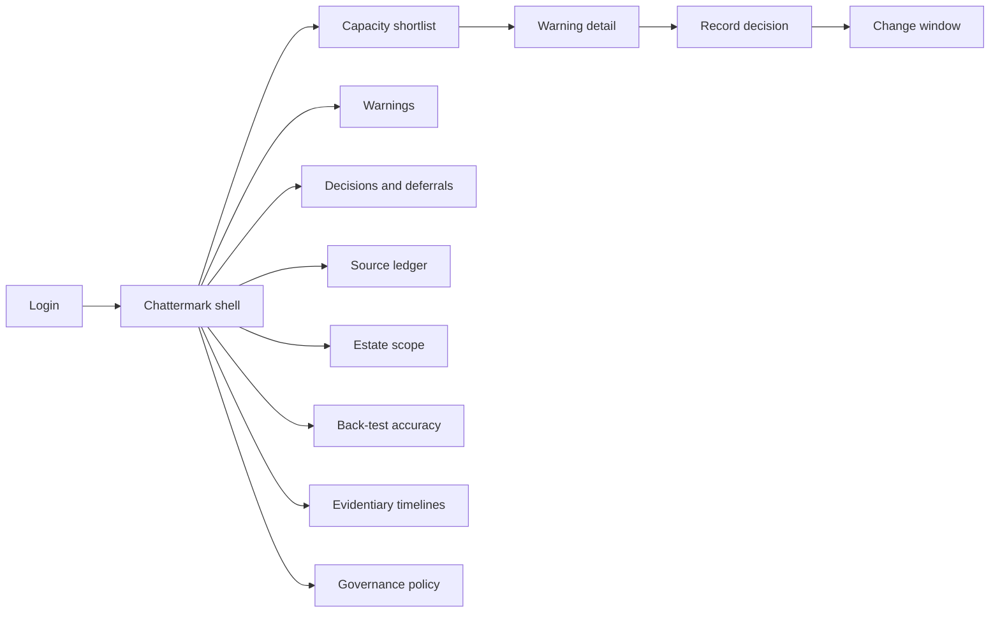
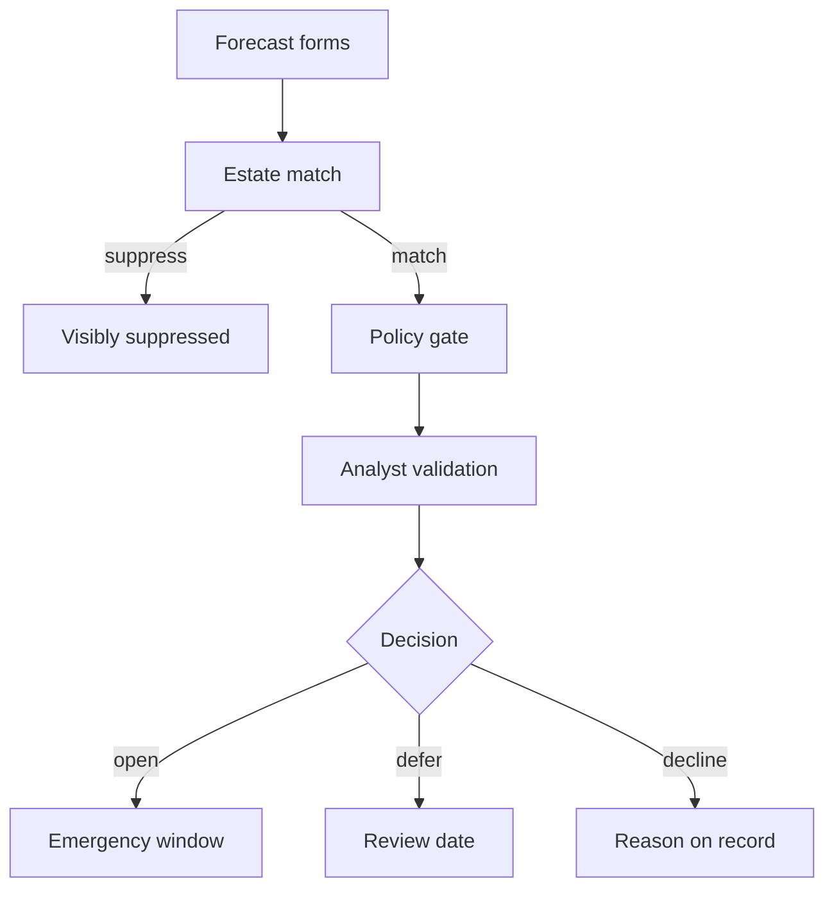

# Chattermark — Web app

**Product:** [PRODUCT.md](./PRODUCT.md)
**Primary surface:** Emergency-window shortlist console (capacity-capped warnings → decide → change calendar)
**Secondary surfaces:** Evidentiary timeline export viewer (read-only audit/insurance pack); source reliability ledger (governance)
**Design thesis:** Chattermark is a change-capacity allocator that happens to read practitioner language — the UI metaphor is a finite set of emergency slots on a wall calendar, not a CVE inventory. Visual language is storm-slate and signal-orange: a warning that earns a window lights like a booked slot; deferred items keep their original evidence snapshot under a review-date pin. Brand sits as a quiet stamp on every decision and timeline export so auditors know whose early-warning record they are reading.

## UX research synthesis

### Category peers (best-in-class)

- **Cisco Kenna / Risk-Based VM:** Risk score that reorders scanner queues by exploit likelihood rather than CVSS alone. Steal: shortlist sized to remediation capacity; reject opaque “risk score” without quoted source language.
- **Tenable Vulnerability Management:** Asset-scoped findings, remediation owners, and exportable risk history. Steal: estate match / suppress non-applicable; reject CVSS-first default sort as the home experience.
- **Rapid7 InsightVM / InsightConnect:** Remediation projects tied to change workflows and SLAs. Steal: terminal decision states wired toward ITSM; reject alert digests that expire without an owner.
- **VulnCheck / CISA KEV-style exploit intel UIs:** Clear exploit-corroboration badges and publication timing. Steal: lead-time clocks and back-tested precision panels; reject volume-of-mentions as the primary rank.

### Patterns to adopt / reject

- **Adopt:** Capacity-capped shortlist as home; quoted messages + named sources + historical accuracy; dual score with/without suspected manipulation; estate-scoped suppression; mandatory open/defer/decline; append-only evidence snapshot at issuance; self-reported bad quarters.
- **Reject:** Scored inventory of every CVE; “no warning = safe” language; autonomous patch triggers; single-source escalation; purple AI severity cards; expiring alerts without a decision.

### Trust, density, and workflow constraints from PRODUCT.md

Capacity is the scarce resource (BR-1): the home must never look like another 900-critical queue. Every warning needs provenance before outage (BR-2). Absence of warning is not safety (BR-3) — chrome and contracts must say so. Lead days are measured (BR-4). Multi-source and manipulation gates are policy (BR-5, BR-6). Decisions are the compliance artefact (BR-7, BR-8). Estate stays tenant-private (BR-9). Back-tests and scoring versions keep history honest (BR-10, BR-11).

## Information architecture

### Nav model

### Roles → default home

| Role | Default home | Why |
|------|--------------|-----|
| Vulnerability manager | Capacity shortlist | Windows vs queue (BR-1) |
| Threat intelligence analyst | Warning detail / validation queue | Provenance gate (BR-2) |
| Change advisory board chair | Escalated → change calendar | Schedule outages |
| Asset / platform owner | Assigned warnings | Quote language + compensating controls |
| CISO / audit / insurance | Evidentiary timelines + accuracy | Defensible what-was-known-when (BR-8) |
| Governance administrator | Escalation policy | Thresholds and manipulation tolerance |

### Cross-links to OpenAPI resources

| Nav area | OpenAPI tags / resources |
|----------|---------------------------|
| Signal browse / binding | Signals |
| Source accuracy | Sources |
| Forecasts / scoring versions | Forecasts |
| Software inventory match | Estate |
| Issued warnings | Warnings |
| Open / defer / decline | Decisions |
| Back-tests, lead-time reports | Assurance |
| Escalation policy | Governance |

## Screen inventory

### Capacity shortlist (home)

- **Purpose:** Answer “which of this period’s emergency windows do we spend?” with a list capped to declared capacity.
- **Entry:** Vuln manager default; period selector.
- **Layout regions:** Capacity meter (windows used / remaining); ranked shortlist (exploit-likelihood, estate match, lead-day clock, source count); disclaimer strip (“absence of warning ≠ low risk”); deferred-due-today pin; accuracy sparkline last two quarters.
- **Primary actions:** Open warning; record decision; adjust capacity for period (logged).
- **Empty / loading / error:** Empty = capacity free + link to policy — not “all clear”; loading = skeleton rows; error = retry with request id.
- **BR / story ties:** BR-1, BR-3; vuln manager stories.

### Warning detail

- **Purpose:** Decide trust before scheduling: quotes, named sources, accuracy, binding method, manipulation-stripped score.
- **Entry:** Shortlist row; TI validation queue; asset-owner assignment.
- **Layout regions:** Vulnerability identity; quoted messages; source cards with historical hit rate; binding method + confidence; score with vs without suspected inauthentic support; estate-affected systems; scoring-version stamp; analyst raise/lower with rationale.
- **Primary actions:** Validate; escalate to CAB; assert compensating control; export evidence snapshot.
- **Empty / loading / error:** Ambiguous binding held = “not escalatable” state with withheld reason.
- **BR / story ties:** BR-2, BR-5, BR-6, BR-11; TI analyst stories.

### Decision capture

- **Purpose:** Terminal states only — window opened, deferred with review date, or declined with reason and owner.
- **Entry:** From warning after validation; CAB action.
- **Layout regions:** Decision form; accountable owner; outage profile / asset owner list; review-date picker for defer; reason codes for decline; append-only prior decisions on this warning.
- **Primary actions:** Submit decision; create ITSM change; schedule deferral resurface.
- **Empty / loading / error:** Cannot close by expiry — UI blocks dismiss-without-decision (BR-7).
- **BR / story ties:** BR-7; change manager stories.

### Deferral review queue

- **Purpose:** Deferred warnings reappear at review date with original evidence intact.
- **Entry:** Home pin; Decisions → Deferrals.
- **Layout regions:** Due/overdue list; frozen evidence snapshot; new signals since deferral (delta, not rewrite of snapshot).
- **Primary actions:** Open/decline/re-defer; keep snapshot immutable.
- **Empty / loading / error:** Empty = no open deferrals.
- **BR / story ties:** BR-7; vuln manager deferral story.

### Estate scope

- **Purpose:** Match warnings to software/versions actually run; suppress non-applicable visibly.
- **Entry:** Estate nav; sync from CMDB/scanner.
- **Layout regions:** Inventory health; match rules; suppressed-this-period count; tenant-isolation notice.
- **Primary actions:** Sync inventory; review suppressions; fix false non-match.
- **Empty / loading / error:** No inventory = block shortlist with setup CTA (avoid unscoped firehose).
- **BR / story ties:** BR-9.

### Source reliability ledger

- **Purpose:** Earn/revoke trust via back-tested accuracy; enforce multi-source policy.
- **Entry:** Sources nav; from warning source card.
- **Layout regions:** Per-source precision vs severity and exploitation; minimum evidence volume gate; revoke/deweight controls; purpose-limitation notice for evaluative personal data.
- **Primary actions:** Deweight source; view contributing warnings; export ledger slice for audit.
- **Empty / loading / error:** New source below volume = “insufficient history” badge, cannot solo-escalate.
- **BR / story ties:** BR-5, BR-10.

### Manipulation screening

- **Purpose:** Show coordinated amplification and recomputed score on surviving support.
- **Entry:** Warning detail panel; Assurance.
- **Layout regions:** Suspected cluster summary; score delta; withhold/degrade recommendation; disclosure to analyst.
- **Primary actions:** Accept degraded warning; withhold; log override with reason.
- **Empty / loading / error:** No manipulation = explicit clear state with last screen timestamp.
- **BR / story ties:** BR-6.

### Back-test and accuracy report

- **Purpose:** Realised precision including bad quarters; feed renewal and CAB trust.
- **Entry:** Assurance; CISO home shortcut.
- **Layout regions:** Precision at customer capacity; exploited coverage; lead-day distribution; quarters underperformed; scoring-version changelog.
- **Primary actions:** Export accuracy report; compare periods.
- **Empty / loading / error:** Too early for ground truth = “awaiting NVD/exploit corroboration.”
- **BR / story ties:** BR-4, BR-10; CAB accuracy story.

### Evidentiary timeline export

- **Purpose:** Defensible what-was-known-when for regulator, insurer, board.
- **Entry:** Timeline nav; from incident or insurance request.
- **Layout regions:** Chronological warnings + decisions + evidence snapshots; export PDF/JSON; hash of pack.
- **Primary actions:** Generate pack; verify integrity; share to GRC.
- **Empty / loading / error:** No decisions in range = empty pack with policy reminder.
- **BR / story ties:** BR-8; CISO/audit stories.

### Governance policy

- **Purpose:** Configure escalation threshold, min independent sources, manipulation tolerance — all change-logged.
- **Entry:** Admin nav.
- **Layout regions:** Policy editor; change log; preview impact on current forecasts; commercial capacity linkage note.
- **Primary actions:** Publish policy version; simulate shortlist size.
- **Empty / loading / error:** Invalid config (single-source allowed) = validation block (BR-5).
- **BR / story ties:** BR-5, BR-6, BR-12; governance admin stories.

### Change window board

- **Purpose:** Map accepted warnings onto emergency calendar with owners and outage profile.
- **Entry:** From accepted decision; change manager home.
- **Layout regions:** Calendar slots; linked warning; completion state; escalated-but-not-implemented flags.
- **Primary actions:** Schedule; mark complete; flag process bottleneck.
- **Empty / loading / error:** ITSM sync fail = local draft with retry.
- **BR / story ties:** Change manager stories; BR-7.

## Key flows

1. **Spend a window** — shortlist item → provenance review → validate → open window → ITSM change; failure: manipulation collapse or estate non-match blocks escalation.

2. **Defer and resurface** — defer with date → freeze snapshot → due date → re-decide with snapshot + delta signals (BR-7).

3. **Manipulation degrade** — screen detects cluster → recompute score → withhold or issue degraded → analyst disclosure (BR-6).

4. **Back-test loop** — NVD/exploit ground truth → update source ledger → customer accuracy report including bad quarters (BR-10).

5. **Insurance timeline** — select incident window → assemble warnings/decisions/snapshots → sealed export (BR-8).

## Design system

### Tokens (CSS variables)

- `--color-ink: #E8EEF4` — primary text
- `--color-ground: #0C1118` — app ground
- `--color-panel: #151C26` — panels
- `--color-rule: #2C3A4A` — dividers
- `--color-slot: #E07A3D` — booked emergency window / warning signal orange
- `--color-slot-dim: #8A4A28` — deferred pin
- `--color-trust: #5BA88A` — multi-source cleared / back-test pass
- `--color-warn: #C9A227` — manipulation suspected
- `--color-danger: #D14B4B` — withhold / policy breach
- `--color-steel: #8B9AAB` — secondary labels
- `--color-brand: #E8B896` — Chattermark wordmark accent
- `--font-display: "IBM Plex Sans", sans-serif` — titles and capacity numerals
- `--font-mono: "IBM Plex Mono", monospace` — CVE ids, hashes, timestamps
- `--space-1`…`--space-8`: 4px scale
- `--radius-sm: 4px`; `--radius-md: 8px`
- `--motion-slot: 180ms ease-out` — window booked flash
- `--motion-defer: 220ms ease-in-out` — pin drop on deferral
- `--motion-manip: 320ms pulse` — amber manipulation disclosure
- Atmosphere: faint calendar-grid texture in panel backs; cool top vignette; no stock “hacker” or purple AI imagery.

### Typography & brand

- Display for capacity counts and lead-day numerals; mono for CVE, scoring-version, export hashes.
- Brand wordmark on shortlist, decision, and timeline surfaces; never displaced by generic “Dashboard.”
- Login: brand-first; headline (“Spend the window that matters”); one CTA — no CVE inventory teaser.

### Do / don’t

- **Do:** Cap the shortlist to capacity; show quotes and source hit rates; dual manipulation scores; freeze evidence at issuance; keep declined/deferred visible.
- **Don’t:** CVSS-first home; “all clear” empty states; single-source escalate; purple glow; card grids of vanity KPIs; auto-close by SLA expiry.

### Accessibility & domain trust cues

- AA+ contrast on orange/trust/warn; decision state always in text (Opened / Deferred / Declined).
- Live regions for deferral due and manipulation withhold.
- Focus order: shortlist → provenance → decision → timeline.
- Disclaimer (“absence ≠ safety”) persistent, not tooltip-only.

## Component patterns

- **CapacityMeter** — emergency windows remaining for the period.
- **WarningShortlistRow** — rank, lead-day clock, source count, estate badge.
- **ProvenanceStack** — quotes + named sources + historical accuracy.
- **ManipulationDelta** — score with vs without suspected amplification.
- **BindingConfidence** — link-follow method and ambiguity hold state.
- **DecisionTerminal** — open / defer / decline only; no dismiss.
- **EvidenceSnapshot** — immutable pack at issuance under scoring version.
- **AccuracyQuarterStrip** — realised precision including bad quarters.
- **TimelineExportPack** — hashed evidentiary export for audit/insurance.

## Out of scope for v1 web

- Autonomous patch orchestration agents; full scanner replacement; public social listening for marketing; cross-tenant estate sharing; mobile-native CAB apps; SOC chatbots as primary triage; dark-web credential dumps as signal source.
